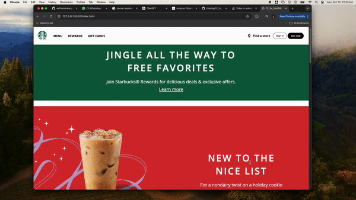

# Starbucks

-This project is a responsive Starbucks landing page created using **HTML** and **CSS**.

-It mimics the design of a modern, clean, and minimalist coffee shop website. 

-The page showcases the Starbucks logo, images, and a sample navigation menu.

# Features

- Responsive design that adapts to different screen sizes.
  
- Smooth animations and transitions.
  
- Navigation menu for seamless browsing.
  
- Clean, modern UI inspired by Starbucks.
  

 # Technologies Used

- **HTML5**: Structuring the content of the page.
  
- **CSS3**: Styling the layout and adding animations.
  
- **Google Fonts**: For beautiful typography.

# Screen Recording
  
-A preview of my Starbucks project is included in the gif below.

King Regards.

